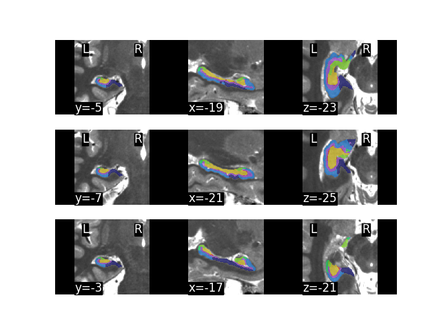
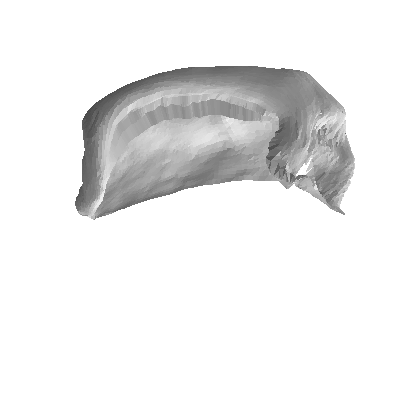
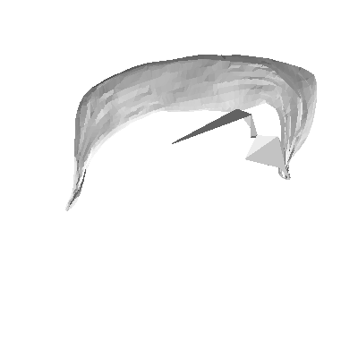

# Quality Control

A complex pipeline can have multiple points of failure, so its imprtant to check the QC folder to ensure results make sense. This will contain (for example) the following files:

    hippunfold/
    └── sub-001
        └── qc
            ├── sub-001_from-T1w_to-CITI168_regqc.png
            ├── sub-001_hemi-L_desc-unetf3d_dice.tsv
            ├── sub-001_hemi-L_space-cropT1w_desc-subfields_atlas-histologyReference2023_dseg.png
            ├── sub-001_hemi-L_space-T1w_den-0p5mm_label-dentate_desc-subfields_midthickness.surf.png
            └── sub-001_hemi-L_space-T1w_den-0p5mm_label-hipp_desc-subfields_midthickness.surf.png

These files will be mirrored in the right (`hemi-R`) hemisphere, but we will skip that here for brevity. 

## Automated checks

A very fast quality check is to simply look at `sub-001_hemi-L_desc-unetf3d_dice.tsv` and ensure that this number is greater than `0.7`. Typically this criterion can be applied to all subjects, and subjects `<0.7` can simply be automatically discarded. A more in-depth explanation for this is provided at the bottom of this page. 

To better understand some common points of failure, let's walk through the other files contained here:

## Catch-all failures

A good way to be sure that nothing has failed is also to look at the final results, as in the following snapshot images.

`sub-001_hemi-L_space-cropT1w_desc-subfields_atlas-histologyReference2023_dseg.png`:

Here we see a volumetric output of subfield parcellations. If you have some hippocampal expertise then you may be able to see right away whether the results make sense. Some common errors include missed parts of the hippocampus and, sometimes, parts of collateral sulcus are included as part of the hippocapus. This is because of gross or "catastrophic" failures in the UNet tissue classification, which should be caught be the above automated check. Still, this collage of sample slices should give a good sense for whether/how the segmentation has failed. 

`sub-001_hemi-L_space-T1w_den-0p5mm_label-hipp_desc-subfields_midthickness.surf.png`:

`sub-001_hemi-L_space-T1w_den-0p5mm_label-dentate_desc-subfields_midthickness.surf.png`:

In these two images we see the output hippocampal and dentate gyrus surfaces, which should roughly resemble those shown in the HippUnfold manuscript (though they may have some differences in shape and/or sulcal/gyral patterning due to inter-individual variance!). 

Sometimes the dentate gyrus surface may show a few large triangles that obscure the rest of the surface, as in the example here. This typically arises when just a few vertices are badly misplaced, and so typically this doesn't have much impact on quantitative results but it can look quite ugly in a figure. This can arise because the structure is small and contains few voxels, none of which have a laplace field close to a given value and so the xyz coordinate of a given laplace value is extrapolated badly. We will try to fix this issue in future releases.

## Registration/cropping failures

Though it seems simple, just getting the image roughly aligned to a template so we can then crop around the left and right hippocampi for subsequent processing (in `space-corobl`) can sometimes fail. We can examine this in the file `sub-001_from-T1w_to-CITI168_regqc.png`:

In this image, the subject tissue boundaries (e.g. grey matter, white matter, CSF, skull) are overlaid on a standard template. This is a linear alignment, so while gyri/sulci may not be well aligned, we should still see fairly good overlap that is sufficient to derive the position of the hippocampus in the image. This most often fails if the input images are in an unexpected orientation (e.g. this sometimes arises in ex-vivo scanning), and can sometimes be imporved by first running FSL's [reorient2std](https://fsl.fmrib.ox.ac.uk/fsl/fslwiki/Fslutils). 

## Checking the automated check

The `Dice > 0.7` rule is a good automatic check because HippUnfold typically shows high sensitivity to details in hippocampal structure, but when it fails it often does so catastrophically. These failures are very obvious, and can often be shown by this simple Dice score that compares a whole mask of the hippocampus to a whole mask of a hippocampus generated by a more conventional but less precise measure: diffeomorphic registration to a standard template. The Dice score should be good between the two methods, but will never be close to perfect (`>0.9`) since the HippUnfold method will differ as its more precise. 

This issue typically only occurs in ~1% of cases. 
