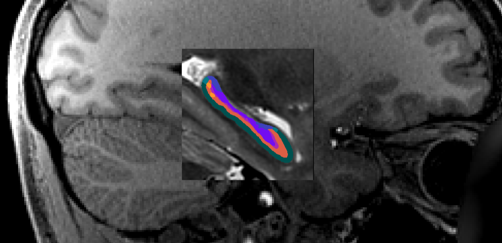
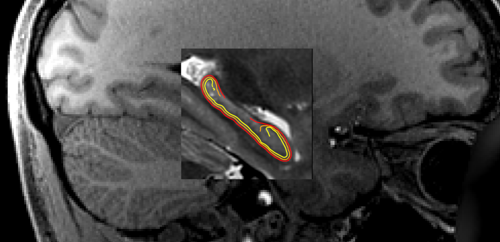
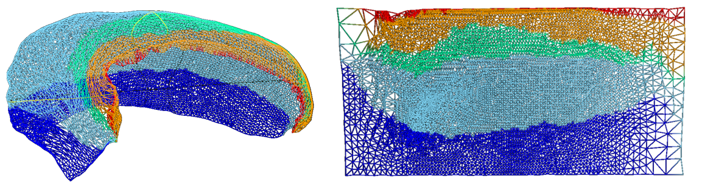
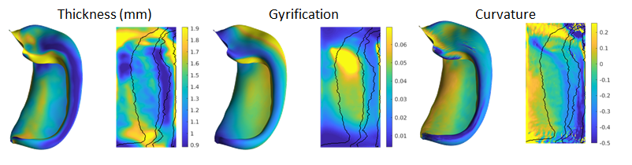
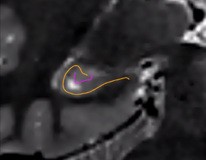
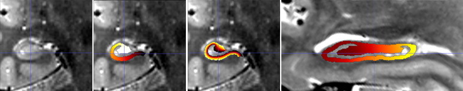

# Output Files

The `PATH_TO_OUTPUT_DIR` folder contains a `logs` and `work` folder for troubleshooting, but for most purposes all the outputs of interest will be in a subfolder called `hippunfold` with the following structure:

    hippunfold/
    └── sub-{subject}
        ├── anat
        ├── coords
        ├── qc
        ├── surf
        └── warps

Briefly, `anat` contains preprocessed volumetric input images and output segmentations in nifti format, `surf` contains surface data in gifti format, `coords` contain Laplace fields spanning the hippocampus, `warps` contains transformations between unfolded and native or 'unfolded' space, and `qc` contains snapshots and useful diagnostic information for quality control.

## anat

This folder contains input anatomical images that have been non-uniformity corrected,
motion-corrected, and, where appropriate, averaged and registered. 
In this example, a `T1w` image was used as a standard reference image, but a `T2w` was also registered and used in tissue segemntation:

    sub-001
     └── anat
         ├── sub-001_desc-preproc_T1w.nii.gz
         ├── sub-001_space-T1w_desc-preproc_T2w.nii.gz
         ├── sub-001_hemi-R_space-T1w_desc-subfields_atlas-bigbrain_dseg.nii.gz
         ├── sub-001_hemi-R_space-cropT1w_desc-preproc_T2w.nii.gz
         └── sub-001_hemi-R_space-cropT1w_desc-subfields_atlas-bigbrain_dseg.nii.gz

As per BIDS guidelines, `desc-preproc` refers to preprocessed input images, `space-T1w` refers to the volume to which the image is registered, `hemi` refers to the left or right hemisphere (only shown for the right in this example), and `dseg` (discrete-segmentation) images with `desc-subfields` contains subfield labels (coded as integers as described in the included `volumes.tsv` file). The subfield atlas used will also be included, by default as `atlas-bigbrain`. Note that HippUnfold does most intermediate processing in an unshown (available in the `work/` folder) `space-corobl` which is cropped, upsampled, and rotated. Downsampling to the original `T1w` space can thus degrade the results and so they are also provided in a higher resolution `space-cropT1w` space which is ideal for conducting volumetry or morphometry measures with high precision and detail. 

For example, the following image shows a whole-brain `T1w` image, a
`space-cropT1w` overlay of the upsampled T2w image (centre square), and a similarly upsampled output
subfield segmentation (colour).

## surf

### surface meshes

Surface meshes (geometry files) are in `.surf.gii` format, and are
provided in both the native space (`space-T1w`) and the unfolded space
(`space-unfolded`). In each space, there are `inner`, `midthickness`,
and `outer` surfaces, which correspond to `white`, `midthickness`, and
`pial` for cortical surfaces:

    sub-{subject}
     └── surf
         └── sub-001_hemi-R_space-{T1w,unfolded}_den-0p5mm_{inner,midthickness,outer}.surf.gii

The following shows surfaces `inner`, `midthickness`, and `outer` in
yellow, orange, and red, respectively.

### surface densities

Surfaces are provided in different density configurations, and are
labelled based on the approximate vertex spacing in each. The default
density is `0p5mm`, which has an approximate vertex spacing of 0.5mm. There are also
`1mm` and `2mm` surfaces which have 1mm or 2mm spacing, respectively (suitable for
lower-resolution BOLD data). Previous versions of hippunfold exclusively
used a `unfoldiso` template surface, formed by a 254x126 grid in
the unfolded space, however a downside of this template is that it
results in very non-uniform vertex spacing when transformed to the
native space. The newer `0p5mm`,
`1mm` and `2mm` surfaces are designed to have
closer to uniform vertex spacing in native space, though vertex spacing will not remain uniform when unfolded.
This is illustrated in the the following `den-1mm` mesh in folded and
unfolded space.

All surfaces of the same density (e.g. `1mm`), in both
`space-T1w` and `space-unfolded`, share the same mesh topology and have
corresponding vertices with each other. The vertex locations for
unfolded surfaces are identical for all subjects as well (note that this
of course is not the case for the `space-T1w` surfaces).

### surface metrics

In addition to the geometry files, surface-based shape metrics are
provided in `.shape.gii` format. The thickness, curvature and surface
area are computed using the same methods as cortical surfaces, based on
the surface geometry files, and are provided in the `T1w` space. The
gyrification metric is the ratio of native to unfolded surface area, or
equivalently, the scaling or distortion factor when unfolding:

    sub-{subject}
     └── surf
         └── sub-001_hemi-{L,R}_space-T1w_den-0p5mm_label-hipp_{thickness,curvature,gyrification}.shape.gii
         └── sub-001_hemi-{L,R}_space-T1w_den-0p5mm_label-dentate_{curvature,gyrification}.shape.gii

These metrics are shown in both folded and unfolded space in the images
below. Note that these results are from group-averaged data and so
individual subject maps may show considerably more variability.

### surface labels

The subfield labels from unfolded atlases are also provided for each 
subject, in `.label.gii` format. Analogous to the volume-based labels,
the name of the atlas (default: `bigbrain`) is in the file name.

    sub-{subject}
     └── surf
         └── sub-001_hemi-{L,R}_space-T1w_den-0p5mm_label-hipp_atlas-bigbrain_subfields.label.gii

### cifti files

In addition to lateralized `.shape.gii` and `.label.gii` metrics and labels,
we also provide data mapped to hippocampi from hemispheres in a single
file using the corresponding CIFTI formats, `.dscalar.nii` and `.dlabel.nii`. 
Note: since CIFTI does not support hippocampus
surfaces (yet), we make use of the `CORTEX_LEFT` and `CORTEX_RIGHT` labels for
the hippocampal surfaces. 

    sub-{subject}
     └── surf
         ├── sub-001_space-T1w_den-0p5mm_label-{hipp,dentate}_{thickness,curvature,gyrification}.dscalar.nii
         └── sub-001_space-T1w_den-0p5mm_label-hipp_atlas-bigbrain_subfields.dlabel.nii

### spec files

Finally, these files are packaged together for easy viewing in
Connectome Workbench, `wb_view`, in the following `.spec` files, for
each hemisphere and structure separately, and combined:

    sub-{subject}
     └── surf
         ├── sub-001_hemi-{L,R}_space-T1w_den-0p5mm_label-{hipp,dentate}_surfaces.spec
         └── sub-001_space-T1w_den-0p5mm_label-{hipp,dentate}_surfaces.spec

### New: label-dentate

HippUnfold v1.0.0 introduces `label-dentate` files which represent a distinct surface making up the dentate gyrus (reflecting its distinct topology from the rest of the cortex). The rest of the surfaces are given the name `label-hipp` to differentiate them from these new files. 

These are illustrated in the following image (orange represents the usual hippocampal midthickness surface, while violet shows the new `dentate` surface):

Note that the dentate uses the same unfolding methods as the rest of the hippocampus, but with several caveats. Given its small size, its boundaries are not easily deliminated and so `inner`, `outer`, and `thickness` gifti surfaces are omitted. Furthermore, Laplace coordinates and therefore vertex spacing are not guaranteed to be topologically equivalent as they are obtained through volumetric registration with the template shape injection step of this workflow.  

Corresponding `coords` and `warp` files are also generated.

### New: myelin maps

If your dataset has T1w and T2w images (and you are using `--modality=T1w` or `--modality=T2w`), then you can enable the generation of myelin maps as the ratio of T1w over T2w images. This division is done in the `corobl` space, and provides `myelin.shape.gii` surface metrics, and also includes these in the CIFTI and spec files. 

This option is enabled with the `--generate-myelin-maps` command-line option.

## coords

Hippunfold also provides images that represent anatomical gradients
along the 3 principal axes of the hippocampus, longitudinal from
anterior to posterior, lamellar from proximal (dentate gyrus) to distal
(subiculum), and laminar from inner (SRLM) to outer. These are provided
in the images suffixed with `coords.nii.gz` with the direction indicated
by `dir-{direction}` as `AP`, `PD` or `IO`, and intensities from 0 to 1,
e.g. 0 representing the Anterior end and 1 the Posterior end.

Here is an example showing coronal slices of the hippocampus with the
PD, IO, and AP (sagittal slice) overlaid.

Note that these images have been resampled to `space-corobl` which is
the space in which most processing is done internally. These can be seen
in the `work/` output directory or specified as a possible output space.

## warps

ITK transforms to warp images between the `T1w` space to the `unfolded`
space, are provided for each hippocampus:

    sub-{subject}
     └── seg
         └── sub-001_hemi-R_from-T1w_to-unfold_mode-image_xfm.nii.gz
         └── sub-001_hemi-R_from-unfold_to-T1w_mode-image_xfm.nii.gz

These are ITK transforms that can transform any image that is in `T1w`
space (can be any resolution and FOV, as long as aligned to `T1w`), to
the `unfolded` hippocampal volume space, and vice-versa. You can use the
warp itself as a reference image, e.g.:

    antsApplyTransforms -d 3 \
    -i sub-001_space-T1w_FA.nii.gz \
    -o sub-001_hemi-L_space-unfolded_FA.nii.gz \
    -t sub-001_hemi-L_from-T1w_to-unfold_mode-image_xfm.nii.gz \
    -r sub-001_space-unfolded_refvol.nii.gz

## Additional Files

The top-level `PATH_TO_OUTPUT_DIR` contains additional folders:

    ├── hippunfold
    ├── logs
    ├── work
    └── .snakemake

The hidden `.snakemake` folder contains a record of the code and parameters used,
and paths to the inputs.

Workflow steps that write logs to file are stored in the `logs`
subfolder, with file names based on the rule wildcards (e.g. subject,
hemi, etc..).

Intermediate files are stored in the `work` folder. These files and
folders, similar to results, are generally named according to BIDS. This
folder will have `tar.gz` files for each subject, unless the
`--keep_work` option is used.

If the app is run in workflow mode
(`--workflow-mode`/`-W`) which enables direct
use of the `snakemake` CLI to run hippunfold, the
`hippunfold` and `work` folders will be placed
in a `results` folder.
