# Pipeline Details

The HippUnfold workflow is generated based on the input data (e.g. whether 
there are multiple T2w images or a single T2w image), what modality is used
 (e.g. `--modality T1w` or `--modality T2w`), and what optional arguments are
 specified (e.g. `--t1-reg-template`). 

## T1w workflow

Below is a *simplified* rule graph of
 the `--modality T1w` workflow (click on the image to enlarge). 

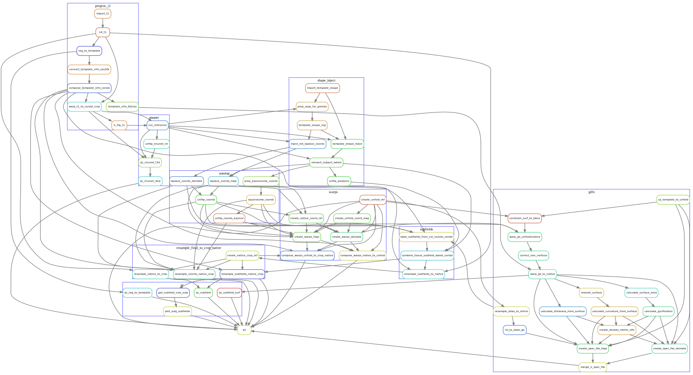

Each rounded rectangle in this diagram represents a *rule*, that is, some code
 or script that produces an output, and the arrows represent file inputs and
 outputs to these rules. 
It is *simplified* in that multiple instances of each rule are not shown, e.g.
the `run_inference` rule runs on both left and right hemispheres (`hemi=L`, `hemi=R`),
but only one `run_inference` box is shown here.
Note that the `all` rule is special in that it is the 
target rule for the workflow (i.e. all the final output files of the workflow 
are inputs to this rule. 

The workflow diagram is also organized into groups of 
rules, which are defined by the names of the rule files, which can be found in
 the [rules sub-folder](http://github.com/khanlab/hippunfold/tree/master/hippunfold/workflow/rules)  
in the workflow source. For example, the [preproc_t1](http://github.com/khanlab/hippunfold/tree/master/hippunfold/workflow/rules/preproc_t1.smk)  file contains the rules related to pre-processing the T1w images, and these are 
grouped together in the above diagram by a blue rectangle labelled `preproc_t1`. 

### Pre-processing

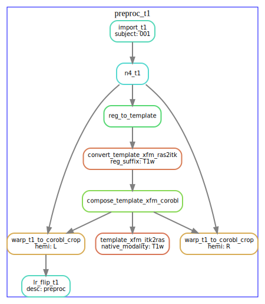

### U-net segmentation

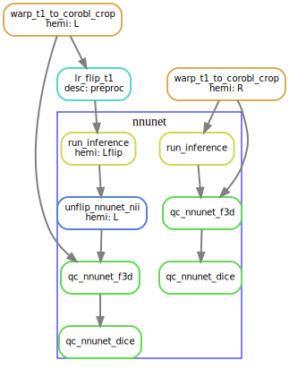

### Template-based shape injection

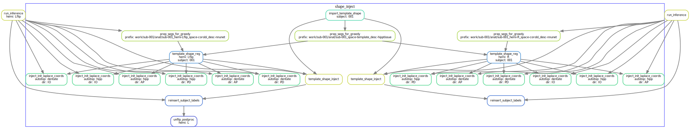

### Laplace & equivolume coordinates

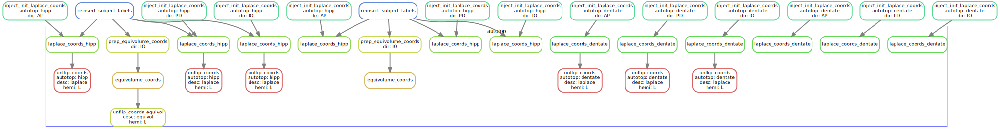

### Subfields processing

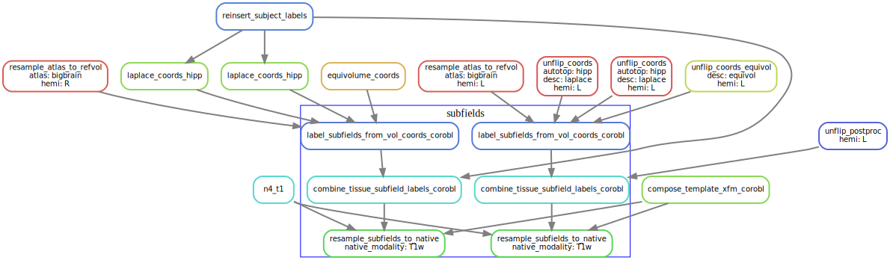

### Generating warp files

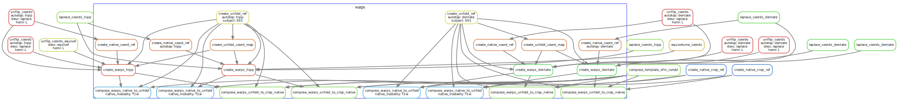

### Surface processing

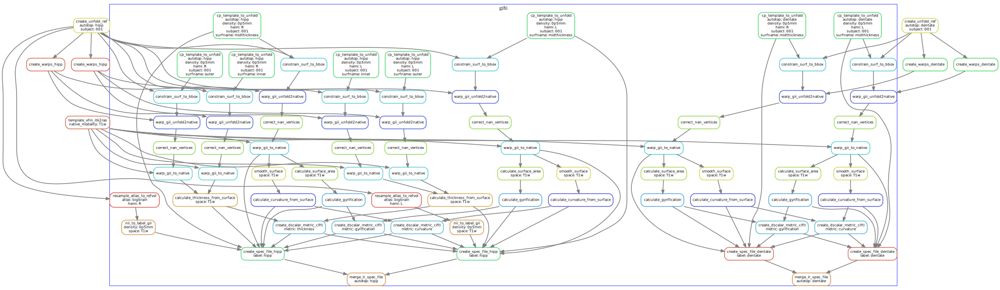

### Resampling to output resolution

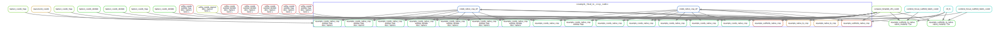

### Quality control snapshots

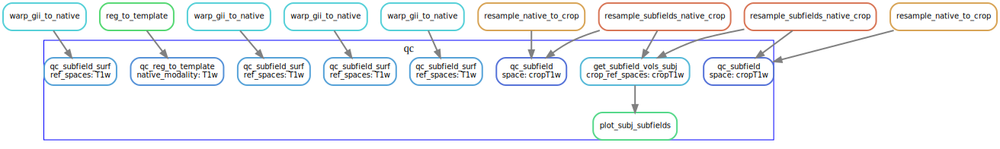

## T2w workflow 

In this workflow (`--modality T2w`) the T1w image is not used at all, and instead the T2w is used
both for initial linear registration and the the `run_inference` rule. 

## T2w workflow using T1w for initial registration

If the `--t1-reg-template`  option is used with `--modality T2w`, then the T1w is used for 
the initial linear registration to the template, and T1w to T2w co-registration is used 
to ultimately bring the T2w in alignment to the template prior to running inference on 
the T2w image. This option is often used when the T2w image is a reduced field of view (e.g. 
coronal oblique to the hippocampus T2w FSE scans). 

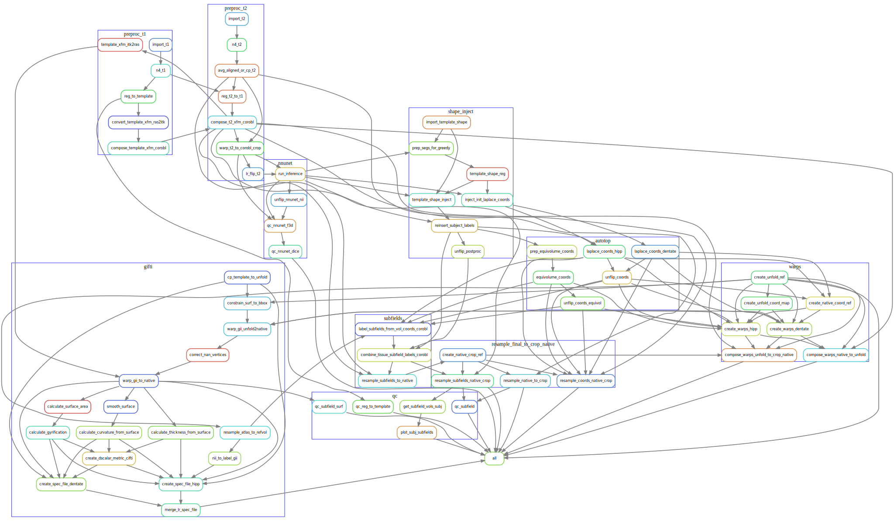

