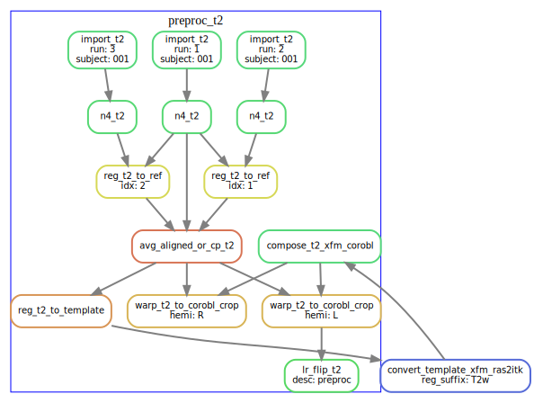
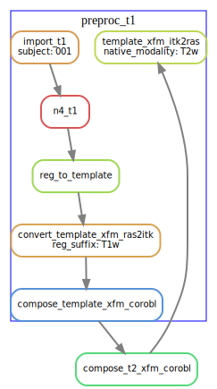
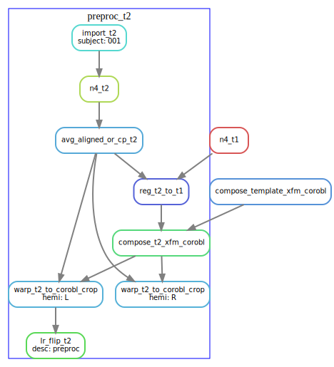
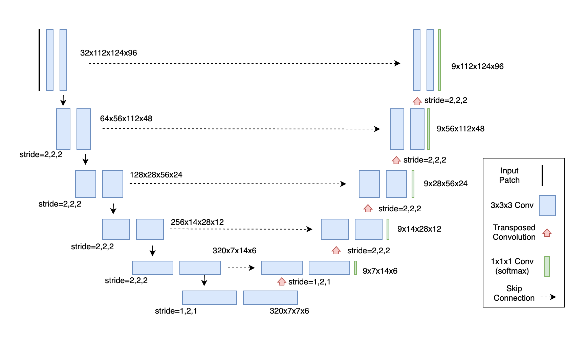
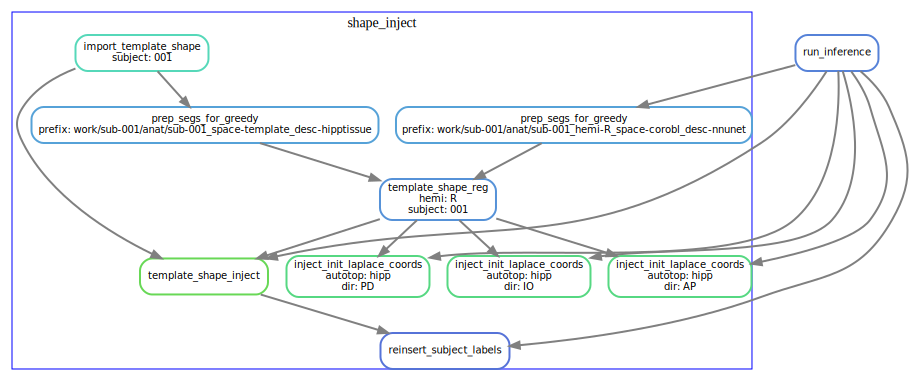
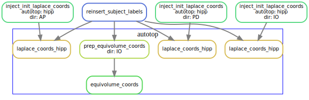
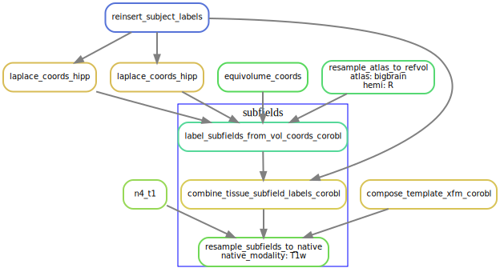
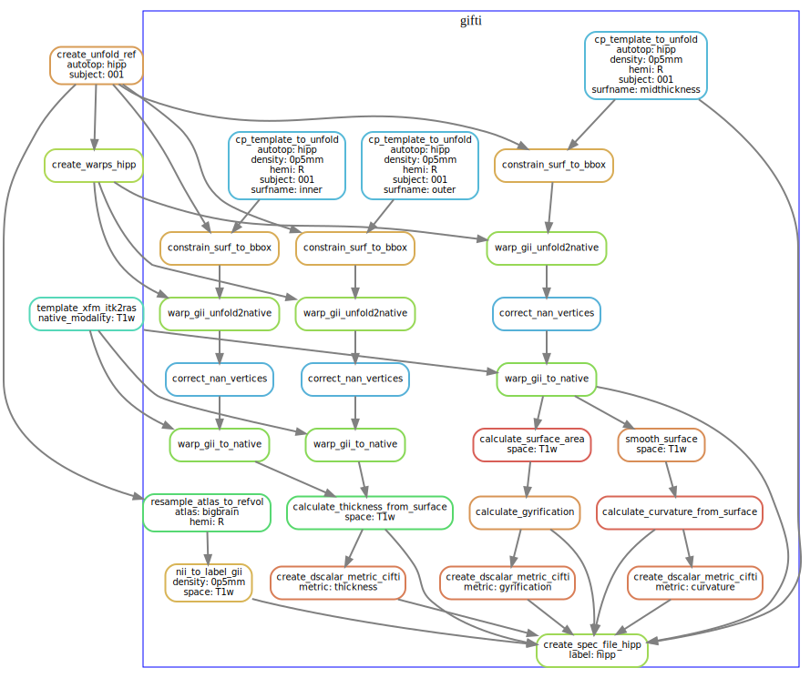

# Pipeline Details

## T1w workflow

TODO: move this section down below (after introducing each subsection)

Below is a *simplified* rule graph of
 the `--modality T1w` workflow (click on the image to enlarge). 

Each rounded rectangle in this diagram represents a *rule*, that is, some code
 or script that produces an output, and the arrows represent file inputs and
 outputs to these rules. 
It is *simplified* in that multiple instances of each rule are not shown, e.g.
the `run_inference` rule runs on both left and right hemispheres (`hemi=L`, `hemi=R`),
but only one `run_inference` box is shown here.
Note that the `all` rule is special in that it is the 
target rule for the workflow (i.e. all the final output files of the workflow 
are inputs to this rule. 

The workflow diagram is also organized into groups of 
rules, which are defined by the names of the rule files, which can be found in
 the [rules sub-folder](http://github.com/khanlab/hippunfold/tree/master/hippunfold/workflow/rules)  
in the workflow source. For example, the [preproc_t1](http://github.com/khanlab/hippunfold/tree/master/hippunfold/workflow/rules/preproc_t1.smk)  file contains the rules related to pre-processing the T1w images, and these are 
grouped together in the above diagram by a blue rectangle labelled `preproc_t1`. 

### Pre-processing

The pre-processing workflow for HippUnfold is generated based on the input data (e.g. whether 
there are multiple T2w images or a single T2w image), what modality is used
 (e.g. `--modality T1w` or `--modality T2w`), and what optional arguments are
 specified (e.g. `--t1-reg-template`). 

### T1w pre-processing

T1w images are imported, intensity-corrected using N4, and linearly registered 
to the template image (default: CITI168 - an HCP T1w template). An existing transformation to 
align the images in a coronal oblique (`space-corobl`) orientation is concatenated, and 
this space is used to define the left and right hippocampus bounding boxes in 0.3mm isotropic space. The left 
hippocampus subvolume is left-right flipped at this stage too (subsequent steps in the `corobl` space operate
on both the `hemi-R` and `hemi-Lflip` images).

### T2w pre-processing

T2w images are processed similarly, except the T2w version of the template is used. If multiple T2w images
exist, these are motion-corrected and averaged prior to N4 correction. The diagram below shows the T2w pre-
processing workflow for a dataset with three T2w runs.

For T2w images where template registration is failing (e.g. because the T2w images have a limited FOV),
the `--t1-reg-template` option can be used, and will perform template registration with the T1w images, along with 
a within-subject registration of the T2w to the T1w, concatenating all the transforms. This is shown in the diagrams below (with a single T2w image in this case):

### U-net segmentation

### Template-based shape injection

The following diagram shows the workflow, but simplified to contain one hemisphere (`--hemi R`), and excluding the dentate gyrus.

### Laplace & equivolume coordinates

The following diagram shows the workflow, but simplified to contain one hemisphere (`--hemi R`), and excluding the dentate gyrus.

### Subfields processing

The following diagram shows the workflow, but simplified to contain one hemisphere (`--hemi R`), and excluding the dentate gyrus.

### Generating warp files

The following diagram shows the workflow, but simplified to contain one hemisphere (`--hemi R`), and excluding the dentate gyrus.

### Surface processing

The following diagram shows the workflow, but simplified to contain one hemisphere (`--hemi R`), and excluding the dentate gyrus.

### Additional steps

Resampling to output resolution, quality control snapshot generation, and archiving the work folder are steps 
that are also carried out by the workflow, but the DAGs are now shown here because of the many inputs/outputs, and the linear
workflow structure.

## T2w workflow 

In this workflow (`--modality T2w`) the T1w image is not used at all, and instead the T2w is used
both for initial linear registration and the the `run_inference` rule. 

## T2w workflow using T1w for initial registration

If the `--t1-reg-template`  option is used with `--modality T2w`, then the T1w is used for 
the initial linear registration to the template, and T1w to T2w co-registration is used 
to ultimately bring the T2w in alignment to the template prior to running inference on 
the T2w image. This option is often used when the T2w image is a reduced field of view (e.g. 
coronal oblique to the hippocampus T2w FSE scans). 

