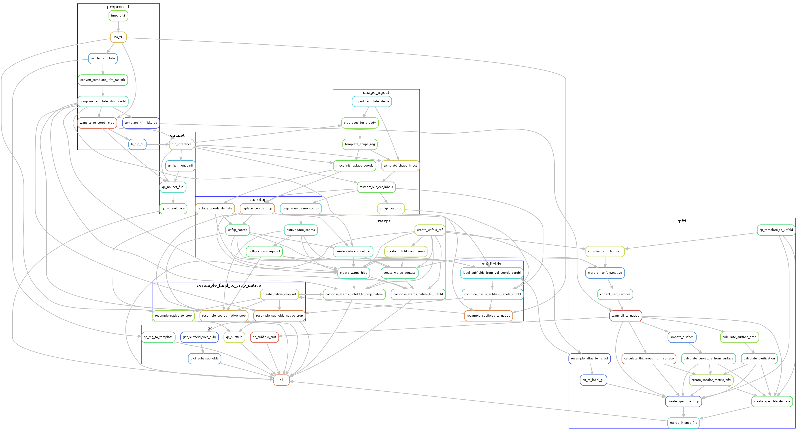

# Pipeline Details

This section describes the HippUnfold workflow, that is, 
the steps taken to produce the intermediate and final files.
HippUnfold is a Snakemake workflow, and thus the workflow is a 
 directed acyclic graph (DAG) that is automatically configured based
on a set of rules. 

## Overall workflow

Below is a example *simplified* visualization of the workflow DAG
for the `--modality T1w` workflow.  Each rounded rectangle in the DAG 
represents a *rule*, that is, some code or script that produces 
output file(s), and the arrows represent file inputs and outputs to these 
rules.  It is *simplified* in that multiple 
instances of each rule are not shown, e.g. the `run_inference` rule 
runs on both left and right hemispheres (`hemi=L`, `hemi=R`),
but only one `run_inference` box is shown here.  

Although it may still look very complex (click on the image to 
enlarge), it is also  organized into groups of rules, 
each representing the main phases of the workflow. Each
grouped set of rules also exist in separate rule files,
 which can be found in
 the [rules sub-folder](http://github.com/khanlab/hippunfold/tree/master/hippunfold/workflow/rules)  
in the workflow source. For example, the [preproc_t1](http://github.com/khanlab/hippunfold/tree/master/hippunfold/workflow/rules/preproc_t1.smk)  file contains the rules related to pre-processing the T1w images, and these are 
grouped together in the above diagram by a blue rectangle labelled `preproc_t1`. 

The main phases of the workflow are described in the sections below, zooming in
on the rules used in each blue rectangle, one at a time.

## Pre-processing

The pre-processing workflow for HippUnfold is generated based on the input data (e.g. whether 
there are multiple T2w images or a single T2w image), what modality is used
 (e.g. `--modality T1w` or `--modality T2w`), and what optional arguments are
 specified (e.g. `--t1-reg-template`). 

### T1w pre-processing

T1w images are imported, intensity-corrected using N4, and linearly registered 
to the template image (default: CITI168 - an HCP T1w template). An existing transformation to 
align the images in a coronal oblique (`space-corobl`) orientation is concatenated, and 
this space is used to define the left and right hippocampus bounding boxes in 0.3mm isotropic space. The left 
hippocampus subvolume is left-right flipped at this stage too (subsequent steps in the `corobl` space operate
on both the `hemi-R` and `hemi-Lflip` images).

### T2w pre-processing

T2w images are processed similarly, except the T2w version of the template is used. If multiple T2w images
exist, these are motion-corrected and averaged prior to N4 correction. The diagram below shows the T2w pre-
processing workflow for a dataset with three T2w runs.

### T2w with T1w template registration

For T2w images where template registration is failing (e.g. because the T2w images have a limited FOV),
the `--t1-reg-template` option can be used, and will perform template registration with the T1w images, along with 
a within-subject registration of the T2w to the T1w, concatenating all the transforms. This is shown in the diagrams below (with a single T2w image in this case):

Note that these are not the only workflow configurations possible, several other variants exist by using the command-line flags. For example, if you have T1w and T2w images that are already pre-processed and co-registered (e.g. HCP processed data), then you should use the `--skip-preproc` and `--skip-coreg` options to skip N4 and T1w/T2w co-registration.

## U-net segmentation

The U-net segmentation is performed on the cropped, `space-corobl` images, producing tissue segmentations (gray matter, SRLM, and anatomical landmarks for unfolding). This step is done in a single rule, which runs inference on the image using the corresponding
nnU-net model based on the `modality` chosen. This is done on the `R` and `Lflip` hippocampus images, and the `Lflip` is subsequently unflipped. 

## Template-based shape injection

Since the nnU-net segmentation may possibly contain topological errors that can cause issues when the Laplace-based coordinates, we perform an additional registration-based correction step, a shape injection, where we perform non-linear registration of a template hippocampus segmentation and the U-net segmentation, to warp the template shape. Regularization from the registration ensures topology from the template is preserved while it is warped to match the subject hippocampus. In addition to the segmentation, we also propagate Laplace coordinates to serve as an initialization to the next step.

The following diagram shows the workflow, but simplified to contain one hemisphere (`--hemi R`), and excluding the dentate gyrus.

## Laplace & equivolume coordinates

The basis of the hippocampal unfolding is the definition of the Laplace coordinates. Here, Laplace's equation is solved on the domain of the gray matter, using the anatomical landmarks to define boundary conditions. This provides the intrinsic set of anatomical coordinates (AP, PD, IO) for unfolding the hippocampus. For the IO (laminar) coordinates we make use of the equivolume solution instead of Laplace.

The following diagram shows the workflow, but simplified to contain one hemisphere (`--hemi R`), and excluding the dentate gyrus.

## Subfields processing

The volumetric subfield segmentation is derived from the coord images from the last step, along with the atlas that defines how the coordinates map to subfields. 

The following diagram shows the workflow, but simplified to contain one hemisphere (`--hemi R`), and excluding the dentate gyrus.

## Generating warp files

To allow users to transform data between the different spaces, we generate warp files that can be applied to transform volumes of surfaces to and from the native and unfolded spaces.

The following diagram shows the workflow, but simplified to contain one hemisphere (`--hemi R`), and excluding the dentate gyrus.

## Surface processing

Using the warps, we transform standard template unfolded meshes to each subject hippocampus, in order to obtain surface meshes in the native space. These are stored in GIFTI format, and we also produce metric files to quantify surface morphometry (thickness, gyrification, curvature).  

The following diagram shows the workflow, but simplified to contain one hemisphere (`--hemi R`), and excluding the dentate gyrus.

## Additional steps

Resampling to output resolution, quality control snapshot generation, and archiving the work folder are steps 
that are also carried out by the workflow, but the DAGs are now shown here because of the many inputs/outputs, and 
generally have straightforward workflow structures.

